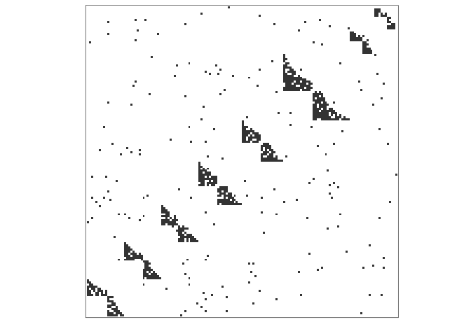
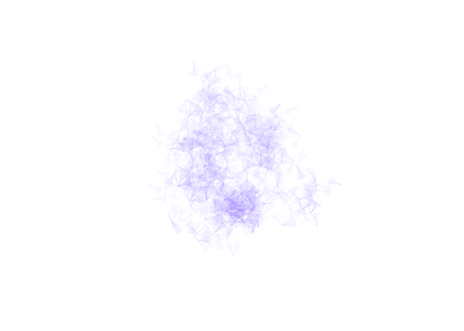
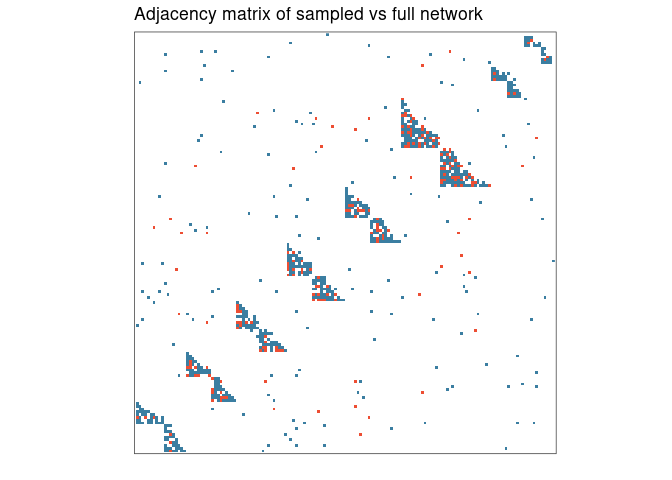
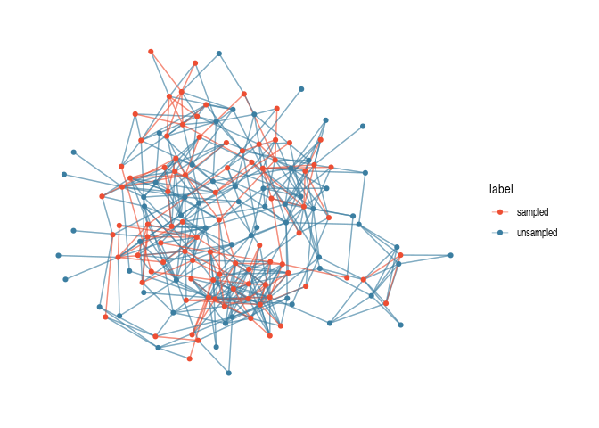

EcoNetGen
================

[](https://travis-ci.org/cboettig/EcoNetGen)
[](https://ci.appveyor.com/project/cboettig/EcoNetGen)
[](https://codecov.io/github/cboettig/EcoNetGen?branch=master)
[](https://cran.r-project.org/package=EcoNetGen)
[](https://www.tidyverse.org/lifecycle/#maturing)
[](https://github.com/metacran/cranlogs.app)
[](https://zenodo.org/badge/latestdoi/116610054)

<!-- README.md is generated from README.Rmd. Please edit that file -->

`EcoNetGen` lets you randomly generate a wide range of interaction
networks with specified size, average degree, modularity, and
topological structure. You can also sample nodes and links from within
simulated networks randomly, by degree, by module, or by abundance.
Simulations and sampling routines are implemented in ‘FORTRAN’,
providing efficient generation times even for large networks. Basic
visualization methods also included. Algorithms implemented here are
described in de Aguiar et al. (2017)
[arXiv:1708.01242](https://arxiv.org/abs/1708.01242).

## Installation

`EcoNetGen` is now on CRAN and can be installed in the usual way:

``` r
install.packages("EcoNetGen")
```

See [NEWS](NEWS.md) for a list of the most recent changes to the
development version and current CRAN release. You can install the
current development version of `EcoNetGen` from GitHub with:

``` r
# install.packages("devtools")
devtools::install_github("cboettig/EcoNetGen")
```

This way requires you have a recent FORTRAN compiler avialble on your
machine.

## Randomly generate networks

This is a basic example which generates a network. See `?netgen` for
documentation describing the parameter arguments. Setting `verbose =
FALSE` (default) surpresses the output summary message.

``` r
library(EcoNetGen)
set.seed(123456) # for a reproducible simulation

network <- netgen(net_size = 150,
                  ave_module_size = 20, 
                  min_module_size = 10,
                  min_submod_size = 5,
                  net_type = "bi-partite nested",
                  ave_degree = 10,
                  verbose = TRUE
                  ) 
#> 
#> module count = 8 
#> average degree = 6.08 
#> average module size = 18.75 
#> number of components = 1 
#> size of largest component = 150
```

We can plot the resulting `igraph` as an adjacency matrix:

``` r
adj_plot(network)
```

<!-- -->

Network `igraph` objects can also be plotted using the standard `igraph`
plotting routines, for example:

``` r
library(igraph)
plot(network, vertex.size= 0, vertex.label=NA, 
     edge.color = rgb(.22,0,1,.02), vertex.shape="none", 
     edge.curved =TRUE, layout = layout_with_kk)
```

<!-- -->

## Sample from a network

``` r
set.seed(123456) # for a reproducible random sampling
sampled <- netsampler(network, 
                     key_nodes_sampler = "degree", 
                     neighbors_sampler = "random",
                     n_key_nodes = 50,
                     n_neighbors = 0.5 # 50%
                    )
```

We can plot the adjacency network, coloring red the sampled nodes. Note
that `adj_plot` objects are just `ggplot` graphs (`geom_raster`) under
the hood, and can be modified with the usual `ggplot` arguments, such as
adding a title and changing the color theme here.

``` r
library(ggplot2) # needed to modify plot

adj_plot(sampled) + 
  ggtitle("Adjacency matrix of sampled vs full network") + 
  scale_fill_manual(values = c("#ED4E33", "#3B7EA1"))
```

<!-- -->

Don’t forget to check out the `ggraph` package, which isn’t required for
`EcoNetGen` but provides a lot of additional great ways to plot your
network. Here we plot the simulated network color-coding the sampled
nodes and edges (indicated by the label “sampled” on vertices and
edges):

``` r
library(ggraph)
ggraph(sampled, layout = 'kk') +
        geom_edge_link(aes(color = label), alpha=0.4) +
        geom_node_point(aes(color = label)) +
        theme_graph() + 
        scale_color_manual(values = c("#ED4E33", "#3B7EA1")) + 
        scale_edge_color_manual(values = c("#ED4E33", "#3B7EA1"))
```

<!-- -->

Or extract and plot just the sampled network:

``` r
subnet <- subgraph.edges(sampled, 
                         E(sampled)[label=="sampled"])

ggraph(subnet, layout = 'graphopt') +
        geom_edge_link(alpha=0.4) +
        geom_node_point() +
        theme_graph() 
```

<!-- -->

## A few example statistics

And we can compute common statistics from igraph as well. Here we
confirm that clustering by “edge betweeness” gives us the expected
number of modules:

``` r
community <- cluster_edge_betweenness(as.undirected(network))
length(groups(community))
#> [1] 9
```

We can check the size of each module as well:

``` r
module_sizes <- sizes(community)
module_sizes
#> Community sizes
#>  1  2  3  4  5  6  7  8  9 
#> 18 19 31 19 22  7  3 20 11
```

Average degree:

``` r
mean(degree(as.undirected(network)))
#> [1] 6.08
```

We can also label and plot the cluster membership:

``` r
V(sampled)$module <- as.character(membership(community))
```

``` r
ggraph(sampled, layout = 'kk') +
  geom_edge_link(alpha=0.1) +
  geom_node_point(aes(colour = module)) + 
  theme_graph()
```

<!-- -->
